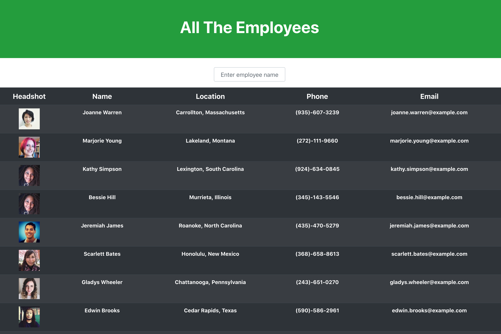

# All The Employees
This application generates a list of employees. It was built with React.  
## Table of Contents
1. [Description](#description)
2. [Installation](#installation)
3. [Contributing](#contributing)
4. [License](#license)
5. [Information](#information)

## Description
Managers need to keep track of their employees. This application allows them to see their employees' non-sensitive information, including a headshot, name, location, email address and phone number.

In the project directory, you can run:

### `npm start`

Runs the app in the development mode. 
Open [http://localhost:3000](http://localhost:3000) to view it in the browser.

The page will reload if you make edits. 
You will also see any lint errors in the console.

You can also find the deployed application on Heroku:

https://whispering-ocean-52911.herokuapp.com/

## Installation

Run `npm install` to include all necessary dependencies. 

## Contributing

Contributions and improvements to the project are welcome at any time. 

### License

## Information

This project was bootstrapped with [Create React App](https://github.com/facebook/create-react-app).

You can learn more in the [Create React App documentation](https://facebook.github.io/create-react-app/docs/getting-started).

To learn React, check out the [React documentation](https://reactjs.org/).
